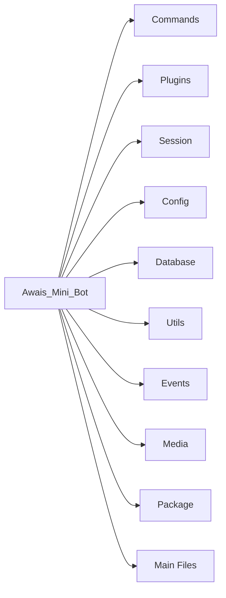

⚡ AWAIS MINI BOT ⚡

<div align="center">
  

🚀 The Ultimate WhatsApp Multi-Device Mini Bot

https://readme-typing-svg.demolab.com?font=Fira+Code&weight=600&size=30&duration=3000&pause=1000&color=00BFFF&center=true&vCenter=true&random=false&width=700&height=80&lines=Fast+%E2%80%A2+Stable+%E2%80%A2+Lightweight;WhatsApp+Multi-Device+Support;Deploy+Anywhere+%F0%9F%9A%80;Beginner+Friendly+%F0%9F%92%BB;Made+with+%E2%9D%A4%EF%B8%8F+by+Awais+Mayo

</div>

<!-- Visitor Counter -->

<div align="center">
  
  
  
  
</div>

---

📌 BADGES

<div align="center">
  
  
  
  
  
  
  
  
  
  
  
  
  
  
  
</div>

---

⚡ FEATURES

<div align="center">
  <table>
    <tr>
      <td><b>⚡ Ultra Fast Performance</b></td>
      <td><b>🤖 WhatsApp Multi-Device Support</b></td>
      <td><b>📱 Mobile Friendly</b></td>
    </tr>
    <tr>
      <td><b>💻 Termux Compatible</b></td>
      <td><b>🐧 Linux Compatible</b></td>
      <td><b>🚄 Railway Deployment</b></td>
    </tr>
    <tr>
      <td><b>☁️ Heroku Deployment</b></td>
      <td><b>🌍 Koyeb Deployment</b></td>
      <td><b>🔥 Easy Installation</b></td>
    </tr>
    <tr>
      <td><b>🛠️ Beginner Friendly</b></td>
      <td><b>📦 Lightweight Source Code</b></td>
      <td><b>🔄 Auto Reconnect</b></td>
    </tr>
    <tr>
      <td><b>🛡️ Stable Connection</b></td>
      <td><b>⚙️ Easy Configuration</b></td>
      <td><b>📚 Well Organized Source</b></td>
    </tr>
    <tr>
      <td><b>🚀 Regular Updates</b></td>
      <td><b>❤️ Open Source</b></td>
      <td><b>🎯 24/7 Online</b></td>
    </tr>
  </table>
</div>

---

📦 INSTALLATION

📱 Termux

```bash
pkg update && pkg upgrade -y
pkg install git nodejs ffmpeg imagemagick -y
git clone https://github.com/awaiscyber25-bot/Awais_Mini_Bot.git
cd Awais_Mini_Bot
npm install
npm start
```

🐧 Linux (Ubuntu/Debian)

```bash
sudo apt update
sudo apt upgrade -y
sudo apt install git nodejs npm ffmpeg imagemagick -y
git clone https://github.com/awaiscyber25-bot/Awais_Mini_Bot.git
cd Awais_Mini_Bot
npm install
npm start
```

🚀 Quick Deploy

Railway

https://railway.app/button.svg

Heroku

https://www.herokucdn.com/deploy/button.svg

Koyeb

https://www.koyeb.com/static/images/deploy/button.svg

---

📂 PROJECT STRUCTURE



```
📁 Awais_Mini_Bot
├── 📁 Commands
│   ├── 📁 General
│   ├── 📁 Fun
│   ├── 📁 Admin
│   └── 📁 Owner
├── 📁 Plugins
├── 📁 Session
├── 📁 Config
├── 📁 Database
├── 📁 Utils
├── 📁 Events
├── 📁 Media
├── 📄 package.json
├── 📄 config.js
└── 📄 main.js
```

---

🌐 CONNECT WITH ME

<div align="center">
  <table>
    <tr>
      <td><a href="https://wa.me/923295533214?text=Hello%20%F0%9F%91%8B%20Awais%20Cyber%20I'm%20From%20Your%20Mini%20Bot"></a></td>
      <td><a href="https://whatsapp.com/channel/0029VbBzlMlIt5rzSeMBE922"></a></td>
      <td><a href="https://youtube.com/@awaismayohacker009?si=bzj41EEp7g4-rCuP"></a></td>
    </tr>
    <tr>
      <td><a href="YOUR_TIKTOK_LINK"></a></td>
      <td><a href="YOUR_TWITTER_LINK"></a></td>
      <td><a href="YOUR_TELEGRAM_LINK"></a></td>
    </tr>
    <tr>
      <td><a href="YOUR_DISCORD_LINK"></a></td>
      <td><a href="https://github.com/awaiscyber25-bot"></a></td>
      <td><a href="https://www.instagram.com/awais_mayo_/"></a></td>
    </tr>
  </table>
</div>

---

📊 GITHUB STATS

<div align="center">
  
  
</div>

<div align="center">
  
  
</div>

---

🎯 SUPPORT

<div align="center">
  <table>
    <tr>
      <td align="center">
        <a href="https://github.com/awaiscyber25-bot/Awais_Mini_Bot/stargazers">
          
        </a>
        <br/>
        <b>⭐ Star the Repository</b>
      </td>
      <td align="center">
        <a href="https://github.com/awaiscyber25-bot/Awais_Mini_Bot/fork">
          
        </a>
        <br/>
        <b>🍴 Fork the Project</b>
      </td>
      <td align="center">
        <a href="https://github.com/awaiscyber25-bot/Awais_Mini_Bot/issues">
          
        </a>
        <br/>
        <b>🐛 Report Issues</b>
      </td>
      <td align="center">
        <a href="https://github.com/awaiscyber25-bot/Awais_Mini_Bot/pulls">
          
        </a>
        <br/>
        <b>🔄 Pull Requests</b>
      </td>
    </tr>
  </table>
</div>

---

⚠️ DISCLAIMER

<div align="center">
  
</div>

This project is created only for educational and development purposes. The developer is not responsible for any misuse of this source code. Please use responsibly and respect WhatsApp's Terms of Service.

---

🤝 CONTRIBUTING

Contributions are what make the open source community such an amazing place to learn, inspire, and create. Any contributions you make are greatly appreciated.

1. Fork the Project
2. Create your Feature Branch (git checkout -b feature/AmazingFeature)
3. Commit your Changes (git commit -m 'Add some AmazingFeature')
4. Push to the Branch (git push origin feature/AmazingFeature)
5. Open a Pull Request

---

📝 LICENSE

This project is licensed under the MIT License - see the LICENSE file for details.

---

💖 ACKNOWLEDGMENTS

· Baileys - WhatsApp Multi-Device Library
· Node.js - JavaScript Runtime
· Termux - Android Terminal
· Railway - Cloud Platform
· Heroku - Cloud Platform
· Koyeb - Cloud Platform

---

<div align="center">
  

🔥 AWAIS MINI BOT 🔥

Fast • Stable • Lightweight • Powerful • Beginner Friendly

Made with ❤️ by Awais Mayo

  
</div>

---

🖼️ COVER IMAGE GENERATION

For the Ultra-HD README Cover Image (1920×1080), use this prompt with AI image generators:

"Create a futuristic cyber/hacker themed banner with 'AWAIS MINI BOT' in glowing neon blue, WhatsApp Multi-Device theme, dark background with glowing circuit patterns, Termux terminal windows, Linux logo, Railway, Heroku, Koyeb deployment logos, coding environment, matrix-like digital rain, neon cyan and blue color scheme, holographic elements, 3D depth, ultra HD 1920x1080, professional tech aesthetic, glowing particles, cyberpunk style, with placeholders for WhatsApp icon, YouTube, TikTok, Twitter, Telegram, Discord social links."

Recommended AI Tools:

· Leonardo AI
· Midjourney
· DALL-E 3
· Stable Diffusion

---
